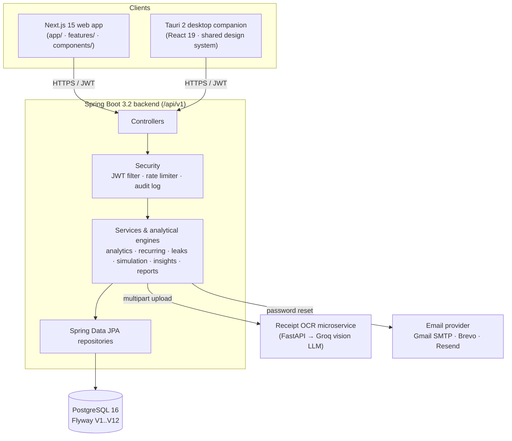
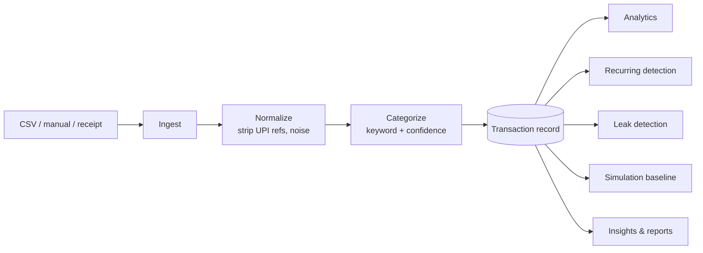
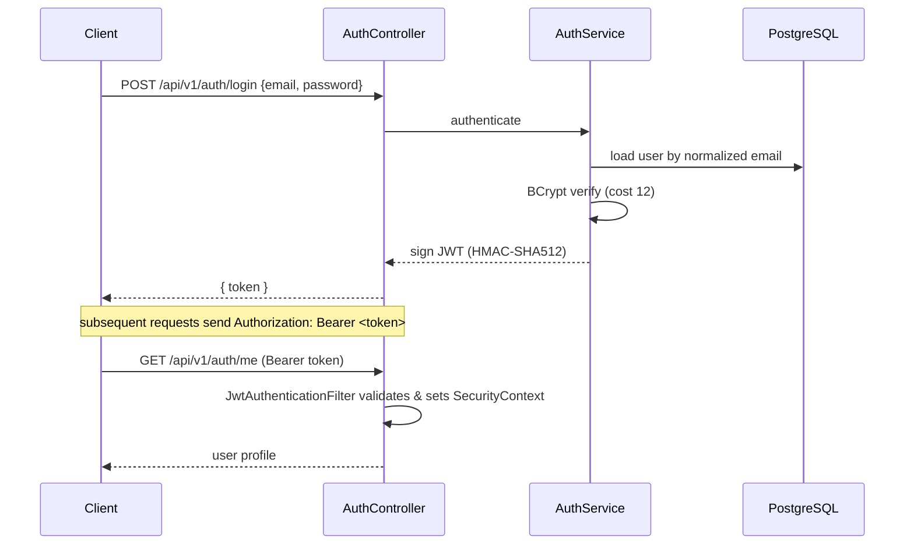
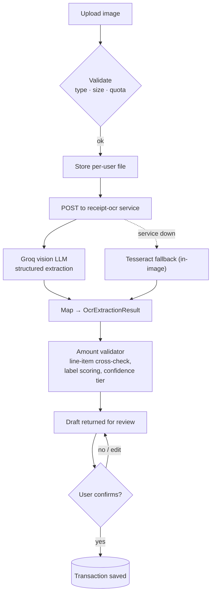
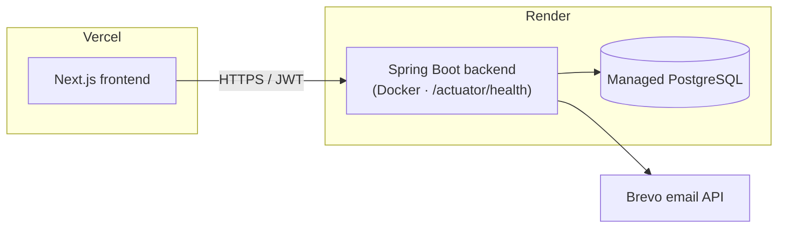
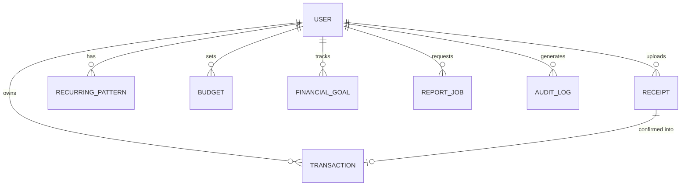

# FlowSight

**Behavioral financial intelligence for people who already know their numbers.**

FlowSight turns raw transactions and receipts into a clear, honest read on how
money actually moves: recurring commitments, recoverable spending, behavioral
drift, and the long-term consequences of the decisions you repeat. It never
connects to a bank. You bring the data (CSV export, manual entry, or a receipt
photo); FlowSight does the thinking.

<!-- SCREENSHOT: Hero — landing page / product marquee -->


<!-- SCREENSHOT: Dashboard — authenticated home with live "this month" stats -->


---

## Table of contents

- [Why this exists](#why-this-exists)
- [Key features](#key-features)
- [Product walkthrough](#product-walkthrough)
- [Architecture](#architecture)
- [Technology stack](#technology-stack)
- [Project structure](#project-structure)
- [Installation](#installation)
- [Environment variables](#environment-variables)
- [Running with Docker](#running-with-docker)
- [Desktop companion](#desktop-companion)
- [API overview](#api-overview)
- [Security](#security)
- [Screenshots](#screenshots)
- [Roadmap](#roadmap)
- [Contributing](#contributing)
- [License](#license)

---

## Why this exists

Most expense trackers stop at categorization. They answer *what* you spent:

- How much went to food this month?
- What were my biggest expenses?

They rarely answer the questions that actually change behavior:

- Are my spending habits drifting upward over time?
- Which recurring commitments could I quietly retire?
- If I take this EMI, how much flexibility do I give up over the next ten years?
- What is that repeated Friday-night habit costing me per year?

The gap is **behavioral and consequential**, not transactional. FlowSight is
built to close it. Instead of a prettier ledger, it layers focused analytical
engines over a single normalized transaction record: behavioral signals,
recurring-payment detection, leak detection, decision simulation, and narrative
report generation. Findings are framed as observations, not judgments, and every
receipt-derived transaction is reviewed by the user before it is ever saved.

---

## Key features

Every item below is implemented in this repository.

### Authentication
- Email + password registration and login, JWT-based (HMAC-SHA512).
- BCrypt (cost 12) password hashing; email normalization and duplicate detection.
- Account-enumeration suppression on login and password-reset flows.
- Password reset by email, with pluggable delivery (Gmail SMTP, Brevo, Resend).
- Stateless sessions; hydration-safe auth guard on the web client.

### Transaction management
- CSV import for HDFC, SBI, and generic/native statement formats, with automatic
  format detection and **per-row error recovery** (one bad row never fails the batch).
- Manual entry with a live auto-categorization preview.
- 14-category taxonomy with keyword-based, confidence-scored categorization.
- Merchant normalization that strips UPI/IMPS/NEFT noise, refs, and trailing junk.
- Full CRUD with per-user row isolation, pagination, and category/date filtering.

### OCR receipt processing
- Image upload (JPEG / PNG / WebP / TIFF / BMP, 5 MB cap) with a per-user quota.
- Structured extraction (merchant, amount, date, line items) via a vision LLM.
- An **amount validator** that catches the classic OCR failure mode: mistaking a
  subtotal, VAT, or GST line for the grand total. It cross-checks line items,
  scores candidate labels, and assigns a confidence tier.
- **Review-first workflow**: OCR produces a draft only. No transaction is created
  until the user confirms an editable, prefilled form. Low-confidence extractions
  raise an explicit warning.
- Built-in Tesseract fallback when the external OCR microservice is unavailable.

### Behavioral insights
- Weekend overspend, lifestyle inflation, category concentration, ticket size,
  and frequency signals derived from transaction history.
- A behavioral profile plus prioritized, plain-language recommendations.

### Financial leak detection
- Surfaces duplicate subscriptions, price creep, silent drains, and bank fees.
- Each finding carries a confidence score and a recoverable-amount estimate,
  ranked by how much money is on the table.

### Recurring detection
- Detects subscriptions and recurring bills across five cadence tiers
  (weekly → annual) using interval, amount-variance, and occurrence signals.
- A 60+ entry brand-alias map resolves messy merchant strings to one identity
  (e.g. `NETFLIX`, `Netflix.com`, `UPI/NETFLIX/MONTHLY` → `netflix`).
- Auto-flags cancellation candidates; users can confirm or dismiss, and
  confirmations survive future re-scans.

### Consequence simulation
- Models one-time purchases, EMIs, recurring expenses, and income changes.
- Projects monthly, yearly, five-year, and ten-year impact against a real
  baseline (your last three months of transactions and active recurring patterns).
- Returns a financial flexibility score before and after the decision.
- Ten-year opportunity cost is the future value of an annuity at an 8% assumed
  annual return.

### Budgets and goals
- Per-category budgets with spend-vs-limit summaries.
- Savings goals with contributions and lifecycle states (active / complete / abandoned).

### Reports
- Monthly summary with category breakdown and tax-eligible deductions.
- Indian Income Tax section **80C / 80D / 80E** detection from transaction text.
- Narrative "intelligence" review PDFs generated **asynchronously** (OpenPDF).
- CSV export for spreadsheets, accountants, and tax filing.

### Desktop companion
- A Tauri 2 native app: a Raycast-style popup for quick capture and top signals.
- Global shortcut, system tray, hide-on-blur, native notifications, background sync.
- Reuses the backend, DTOs, and the web app's design system — no duplicated logic.

### Security and operations
- DTO isolation (entities never leave the service layer), Bean Validation on every request.
- In-process token-bucket rate limiting on sensitive endpoints.
- Append-only audit log written in a `REQUIRES_NEW` transaction so it survives caller rollback.
- Health checks, Flyway migrations, and a hardened HTTP security header set.

---

## Product walkthrough

```
Create account
      │
      ▼
Import transactions   ── CSV (HDFC / SBI / generic) or manual entry
      │
      ▼
Upload receipts       ── image → vision-LLM extraction → amount validation
      │
      ▼
Review & confirm      ── editable draft; nothing saved until you approve
      │
      ▼
Analyze spending      ── category breakdown, cashflow, top merchants, alerts
      │
      ▼
Detect money drains   ── recurring commitments + leak detection (ranked)
      │
      ▼
View behavioral insights ── drift, concentration, curated observations
      │
      ▼
Simulate a decision   ── "what does this EMI cost me over 10 years?"
      │
      ▼
Generate a report     ── narrative PDF + tax-eligible deductions + CSV export
```

---

## Architecture

### System architecture



### Data flow (ingestion)



Every analytical surface reads from the same normalized transaction record. There
is one source of truth, and no engine reaches back into raw bank infrastructure.

### Authentication flow



### OCR pipeline



### Deployment architecture



### Core data relationships



---

## Technology stack

### Frontend
| Layer | Choice |
|---|---|
| Framework | Next.js 15 (App Router) |
| Runtime | React 19 |
| Language | TypeScript 5 |
| Styling | Tailwind CSS 3 |
| State | Zustand (with `persist`) |
| Forms | React Hook Form + Zod |
| Charts | Recharts 3 |
| Motion | Framer Motion 11 |
| UI primitives | Radix UI |

### Backend
| Layer | Choice |
|---|---|
| Framework | Spring Boot 3.2.5 |
| Language | Java 17 |
| Auth | JWT (JJWT 0.12.5, HMAC-SHA512) |
| Password hashing | BCrypt cost 12 |
| Mapping | MapStruct 1.5.5 |
| PDF | OpenPDF 1.3.34 |
| CSV | Apache Commons CSV 1.10 |
| Email | Spring Mail (SMTP) / Brevo / Resend |
| Build | Maven |

### Database
| Layer | Choice |
|---|---|
| Engine | PostgreSQL 16 |
| Migrations | Flyway (V1..V12) |
| Isolation | Per-user row ownership; DTO boundaries between layers |

### AI / OCR
| Layer | Choice |
|---|---|
| OCR service | FastAPI microservice ([bhimrazy/receipt-ocr](https://github.com/bhimrazy/receipt-ocr), pinned commit) |
| Model | Vision LLM via Groq (OpenAI-compatible endpoint) |
| Default model | `meta-llama/llama-4-scout-17b-16e-instruct` |
| Fallback | In-image Tesseract OCR |
| Validation | In-process amount validator with line-item cross-check |

### Desktop
| Layer | Choice |
|---|---|
| Shell | Tauri 2 (Rust) |
| UI | Vite + React 19, shared with the web frontend |
| Native | Global shortcut, system tray, notifications, store-backed JWT |

### Infrastructure & deployment
| Layer | Choice |
|---|---|
| Local orchestration | Docker Compose (`postgres`, `backend`, `frontend`, `receipt-ocr`) |
| CI | GitHub Actions (build, test, lint, Docker image builds) |
| Frontend hosting | Vercel |
| Backend + DB hosting | Render (Blueprint via `render.yaml`) |
| Ports | 3007 web · 8080 API · 5433 db · 8001 OCR · 1420 desktop dev |

---

## Project structure

```
flowsight/
├── backend/                         # Spring Boot API
│   └── src/main/java/com/flowsight/
│       ├── controller/              # HTTP entry points (/api/v1/*)
│       ├── service/                 # Use-case orchestration
│       ├── repository/              # Spring Data JPA
│       ├── entity/                  # JPA entities
│       ├── dto/                     # Request/response shapes
│       ├── analytics/               # Behavioral analytics + recurring detection
│       │   └── simulation/          # Decision simulator engine
│       ├── ocr/                     # Receipt OCR client, mapper, amount validator
│       ├── reports/                 # PDF + intelligence report assembly
│       ├── service/                 # Includes tax-deduction detection
│       ├── email/                   # Gmail / Brevo / Resend delivery
│       ├── security/                # JWT filter, JWT service, rate limiter
│       ├── config/                  # Security, CORS, async, env validation
│       └── exception/               # Domain exceptions + global handler
│   └── src/main/resources/db/migration/   # Flyway V1..V12
│
├── frontend/                        # Next.js 15 web app
│   ├── app/
│   │   ├── auth/                    # Login, register, forgot/reset password
│   │   ├── dashboard/               # Authenticated product surface
│   │   ├── privacy/  terms/         # Legal pages
│   ├── components/                  # layout, motion, ui (Radix), providers
│   ├── features/                    # Per-domain API clients + types
│   └── store/                       # Zustand auth store
│
├── desktop/                         # Tauri 2 desktop companion
│   ├── src/                         # React UI (reuses ../frontend via @ alias)
│   └── src-tauri/                   # Rust shell: window, tray, shortcut
│
├── docker-compose.yml               # Local 4-service stack
├── render.yaml                      # Render Blueprint (backend + Postgres)
├── DEPLOYMENT.md                    # Vercel + Render deployment guide
└── .github/workflows/ci.yml         # CI pipeline
```

---

## Installation

### Prerequisites
- Docker Engine + Docker Compose (the only requirement for the full stack).
- A Groq API key if you want the high-quality vision-LLM receipt path.
- For the desktop companion only: Node 20+ and the Rust toolchain
  (see [Desktop companion](#desktop-companion)).

### 1. Clone

```bash
git clone <repository-url> flowsight
cd flowsight
```

### 2. Configure environment

```bash
cp .env.example .env
```

Fill in at least `JWT_SECRET` (generate with `openssl rand -base64 64`) and, if
you want LLM OCR, `GROQ_API_KEY`. See [Environment variables](#environment-variables).

### 3. Start the stack

```bash
docker compose up -d
```

Flyway runs the database migrations automatically on backend startup.

| Service | URL |
|---|---|
| Frontend | http://localhost:3007 |
| Backend | http://localhost:8080 |
| Health | http://localhost:8080/actuator/health |
| Database | localhost:5433 (Postgres) |
| OCR | http://localhost:8001 |

### Running components individually

**Backend** (requires JDK 17 + a running Postgres):

```bash
cd backend
mvn spring-boot:run
```

**Frontend**:

```bash
cd frontend
npm install
npm run dev        # http://localhost:3007
```

**Tests** (backend):

```bash
cd backend
mvn verify
```

---

## Environment variables

Backend variables are read by `docker-compose.yml`; the frontend reads only
`NEXT_PUBLIC_API_URL`. Never commit real secrets.

| Variable | Required | Purpose | Example / default |
|---|---|---|---|
| `JWT_SECRET` | Yes | HMAC signing key for JWTs | `openssl rand -base64 64` output |
| `JWT_EXPIRATION` | No | Token lifetime (ms) | `86400000` (24h) |
| `POSTGRES_PASSWORD` | No | Postgres password (compose) | `flowsight_dev` |
| `DB_URL` / `DB_USERNAME` / `DB_PASSWORD` | Yes* | Backend DB connection | provided by compose |
| `CORS_ALLOWED_ORIGINS` | No | Comma-separated allowed origins | `http://localhost:3007,...` |
| `NEXT_PUBLIC_API_URL` | Yes | Backend URL exposed to the browser | `http://localhost:8080` |
| `GROQ_API_KEY` | No** | Vision-LLM key for OCR microservice | — |
| `RECEIPT_OCR_URL` | No | Internal OCR service URL | `http://receipt-ocr:8000` |
| `RECEIPT_OCR_MODEL` | No | Vision model id | `meta-llama/llama-4-scout-17b-16e-instruct` |
| `EMAIL_PROVIDER` | No | `gmail` / `brevo` / `resend` | `gmail` |
| `MAIL_HOST` / `MAIL_PORT` / `MAIL_USERNAME` / `MAIL_PASSWORD` / `MAIL_FROM` | No | Gmail SMTP delivery | `smtp.gmail.com` / `587` |
| `BREVO_API_KEY` / `BREVO_SENDER_EMAIL` / `BREVO_SENDER_NAME` | No | Brevo HTTPS email delivery | — |
| `RESEND_API_KEY` / `RESEND_FROM_EMAIL` / `RESEND_REPLY_TO` | No | Resend email delivery | — |
| `FRONTEND_URL` | No | Base URL for password-reset links | `http://localhost:3007` |
| `PASSWORD_RESET_EXPIRATION_MINUTES` | No | Reset-token lifetime | `30` |
| `PASSWORD_RESET_DEV_EXPOSE_LINK` | No | Dev-only: return reset link in API response | `false` |

\* Provided automatically by Docker Compose in local development.
\** Without it, the backend falls back to the built-in Tesseract OCR engine. If
`MAIL_USERNAME`/`MAIL_PASSWORD` are empty, password-reset links are logged rather
than emailed.

---

## Running with Docker

```bash
# Start (detached)
docker compose up -d

# Rebuild after code changes
docker compose up -d --build

# Follow logs
docker compose logs -f backend

# Stop
docker compose down

# Stop and wipe the database volume
docker compose down -v
```

**Troubleshooting**

- **Backend won't start / DB errors** — Postgres must be healthy first; compose
  gates the backend on `pg_isready`. Check `docker compose logs postgres`.
- **OCR service slow to become healthy** — it has a 90s `start_period`; the first
  build pulls the pinned upstream image from GitHub.
- **Frontend calls `localhost:8080` in production** — `NEXT_PUBLIC_API_URL` is
  inlined at build time. Set it before building and redeploy after changes.
- **CORS errors** — the requesting origin must be in `CORS_ALLOWED_ORIGINS`.

---

## Desktop companion

The `desktop/` app is a Tauri 2 shell that reuses the web frontend's components,
DTO types, and API clients (via an `@` alias pointing at `../frontend`). The
backend stays the single source of truth.

```bash
cd desktop
npm install
npm run tauri:dev        # native window with hot reload
npm run tauri:build      # per-OS installers in src-tauri/target/release/bundle
```

Requires the Rust toolchain (and, on Linux, WebKitGTK dev libraries — see
`desktop/README.md`). The backend must be running; the API base defaults to
`http://localhost:8080` (override with `VITE_API_URL`). The backend CORS
allow-list already includes the Tauri origins. To validate the UI without the
native toolchain: `npm run type-check && npm run build`.

---

## API overview

All endpoints are under `/api/v1`. Authentication is a `Bearer` JWT except where
noted. `admin/**` requires the `ADMIN` role.

| Group | Base path | Highlights |
|---|---|---|
| Auth | `/auth` | `register`, `login`, `forgot-password`, `reset-password` (public); `me` |
| Transactions | `/transactions` | CRUD, `POST /csv` bulk import |
| Receipts | `/receipts` | `POST /upload`, list, `POST /{id}/confirm`, delete |
| Analytics | `/analytics` | `overview`, `trend`, `activity-bounds` |
| Insights | `/insights` | Behavioral profile, patterns, recommendations |
| Leaks | `/leaks` | Ranked leak findings with recoverable amounts |
| Recurring | `/recurring` | List/detect, `confirm`, `unconfirm`, dismiss/restore |
| Simulation | `/simulate` | Scenario projection + `flexibility` score |
| Budgets | `/budgets` | Per-category budgets and summaries |
| Goals | `/goals` | Savings goals, `contribute`, `complete`, `abandon` |
| Reports | `/reports` | `csv`, `monthly`, `tax-summary` export |
| Intelligence reports | `/intelligence-reports` | Async narrative PDF generation + `download` |
| Account | `/account` | Profile, receipt quota, `audit-log` |
| Admin | `/admin/quota` | Quota administration (ADMIN only) |

---

## Security

- **Authentication** — JWT (HMAC-SHA512), stateless sessions, hydration-safe client guard.
- **Passwords** — BCrypt cost 12; account-enumeration suppression on login and reset.
- **Authorization** — per-user row ownership at the repository layer; role check on `admin/**`.
- **DTO isolation** — entities live behind MapStruct converters and never reach controllers.
- **Input validation** — Bean Validation on every request DTO, with field-level error mapping.
- **File uploads** — content-type and size validated, per-user storage paths, OCR runs in an isolated container, per-user receipt quota.
- **Rate limiting** — in-process token bucket on sensitive endpoints (in-memory, per instance).
- **HTTP hardening** — `Content-Security-Policy: default-src 'none'`, `frame-ancestors 'none'`, HSTS over HTTPS, `X-Content-Type-Options`, `Referrer-Policy`, `Permissions-Policy`.
- **Audit log** — append-only, written with `REQUIRES_NEW` propagation so entries survive caller rollback.

---

## Screenshots

Reference images live in `screenshots/`. Replace the placeholders below with the
relevant captures.

| Screen | Placeholder |
|---|---|
| Hero / landing | `<!-- SCREENSHOT: hero -->` |
| Dashboard | `<!-- SCREENSHOT: dashboard -->` |
| Transactions | `<!-- SCREENSHOT: transactions -->` |
| Receipt upload & review (OCR) | `<!-- SCREENSHOT: ocr-review -->` |
| Behavioral insights | `<!-- SCREENSHOT: insights -->` |
| Leak detection | `<!-- SCREENSHOT: leaks -->` |
| Decision simulator | `<!-- SCREENSHOT: simulation -->` |
| Desktop companion | `<!-- SCREENSHOT: desktop -->` |
| Responsive / mobile | `<!-- SCREENSHOT: mobile -->` |
| Settings | `<!-- SCREENSHOT: settings -->` |
| Authentication | `<!-- SCREENSHOT: auth -->` |

---

## Roadmap

**Completed**
- Authentication, password reset, and user management
- CSV + manual transaction ingestion with normalization and categorization
- Receipt OCR with amount validation and review-first confirmation
- Analytics, behavioral insights, recurring detection, leak detection
- Decision simulator, budgets, and goals
- Intelligence PDF reports, tax-deduction surfacing (80C/80D/80E), CSV export
- Receipt quota, rate limiting, audit log
- Tauri 2 desktop companion

**In progress**
- Additional bank statement formats
- Bank SMS ingestion pipeline (a transaction source exists; parsing is not yet built)

**Planned**
- Cloud receipt storage with signed URLs (uploads are currently ephemeral in the container)
- Shared/distributed rate limiting across scaled instances
- Operational monitoring (metrics, traces, structured logs)
- Multi-account households

---

## Contributing

Contributions are welcome. Open an issue to discuss substantial changes before
submitting a pull request. Match the existing code style, add tests where logic
is non-trivial (the backend suite runs via `mvn verify`), and keep frontend
changes consistent with the motion and color systems already in place. CI runs
backend build/test, frontend type-check/lint/build, and Docker image builds on
every push and PR.

---

## License

MIT. See [LICENSE](LICENSE).

---

Built with Next.js, React, Spring Boot, PostgreSQL, Tauri, and a Groq vision LLM.
